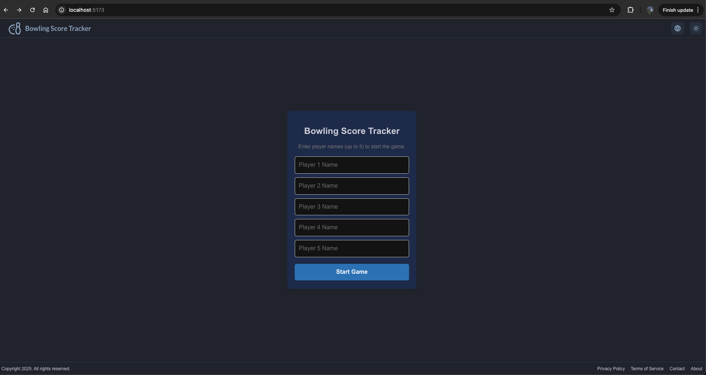
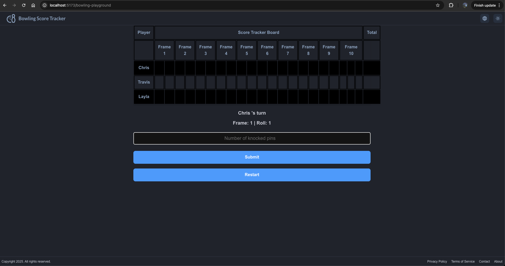
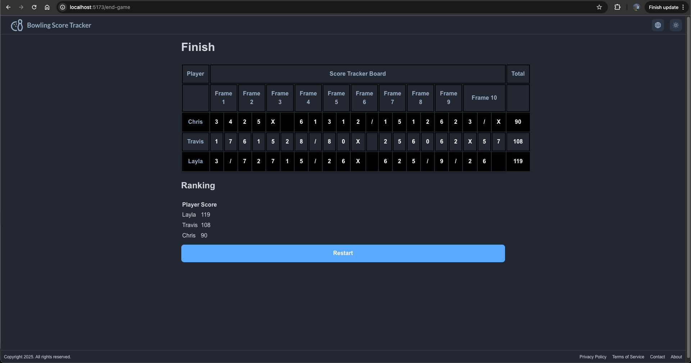

# Bowling Score Tracker Frontend

This is the frontend for the Bowling Score Tracker application. It is built using React and TypeScript.

Home page

Start game:

End game:

## Agenda

- [Prerequisites](#prerequisites)
- [Setup](#setup)
- [Testing](#testing)
- [Linting](#linting)
- [Building](#building)
- [Containerization](#containerization)
- [Deployment](#deployment)
- [Improvements](#improvements)
- [Potential features](#potential-features)

### Prerequisites

- Node.js (>=20)

### Setup

1. Clone the repository
2. Run `yarn` to install dependencies
3. Run `yarn start:dev` to start the development server
4. Open `http://localhost:5173` in your browser

### Testing

- Run `yarn test` to run tests, check code style and code quality
- Run `yarn vitest:watch` to run tests in watch mode
- Run `yarn vitest:coverage` to run tests with coverage

### Linting

- Run `yarn lint` to lint the code
- Run `yarn lint:fix` to lint the code and fix issues

### Building

- Run `yarn build` to build the project
- The build will be available in the `dist` directory

### Containerization

1. Prerequisites

   - Docker

2. Start the frontend in a container

   `yarn start:container`

3. Open `http://localhost:5173` in your browser

### Pull Request

1. When you create a pull request, the following checks will be run:

   - Test: run tests, check code style and code quality
   - Lint: lint the code

2. If all checks pass, you can merge the pull request.

### Deployment

We config the deployment to be done automatically when a PR is merged to the `main` branch. The deployment is done using GitHub Actions.

Before deploying, we need to set up the infrastructure. I have 2 options for setting up the infrastructure:

1. AWS EC2 - Github Action CI/CD

Step 1: Set up EC2 Instance

- Create an EC2 instance (ubuntu) on AWS
- Install Node.js and Nginx on the EC2 instance
- Configure Nginx to serve the frontend

Step 2: Set up deployment user

- Create a new user on the EC2 instance
- Give the user permission to deploy the frontend
- Set up SSH keys for the user
- Alow GitHub Actions to SSH into the EC2 instance

Step 3: Set up GitHub Actions

- Setup EC2 Secrets on GitHub
- Create a yaml file to define the deployment workflow in the `.github/workflows` directory in the frontend repository (refer to: `.github/workflows/deploy_v1.yml`)

Now, every time a PR is merged to the `main` branch, the frontend will be deployed to the EC2 instance.

2. AWS ECS - Github Action CI/CD (Recommended for microservices)

Step 1: Set up AWS ECS

- Create an ECS cluster on AWS: Fargate (serverless), EC2 (self-managed)
- Create a task definition: define configuration for the frontend container
- Create a service: run the frontend container on the ECS cluster
- Create a load balancer (ALB): route traffic to the frontend service
- Create ECR repository

step 2: Create an IAM role for GitHub Actions

- Create an IAM deployment user
- Create IAM policies for ECS deployment
- Attach the policies to the IAM deployment user

step 3: Get the AWS credentials (Access Key ID and Secret Access Key) for the IAM deployment user

step 4: Set up GitHub Secrets

- Create secrets on GitHub to store AWS credentials and ECR repository

Step 5: Set up GitHub Actions

- Create a yaml file to define the deployment workflow in the `.github/workflows` directory in the frontend repository (refer to: `.github/workflows/deploy_v2.yml`)
- The workflow will build the frontend, push the image to ECR, and update the service on ECS

Now, every time a PR is merged to the `main` branch, the frontend will be deployed to the ECS cluster.

### Improvements

- Use Terraform to manage infrastructure as code (I prefer this approach but do not have enough time to implement it)
- Add authentication
- Add a database to store user data for retrieving across sessions
- Add monitoring and logging
- Add error tracking
- Add performance monitoring
- Add security scanning (e.g. Snyk, SonarQube, etc.)
- Add end-to-end testing
- Scalability: Handling higher loads and multiple concurrent users.

### Potential features

- Integrate with AI provider (e.g. OpenAI, DeepSeek, etc.) to predict the win rate based on the players's current performance
